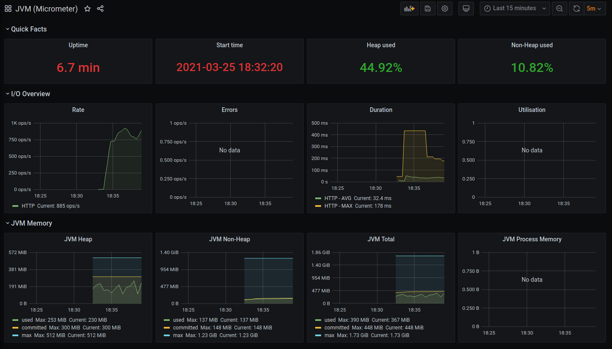
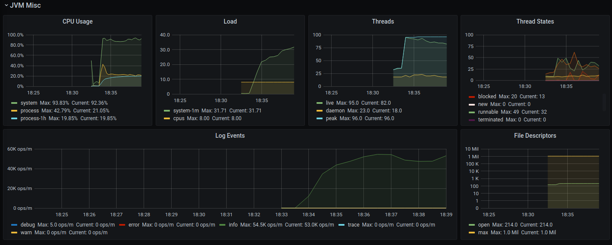
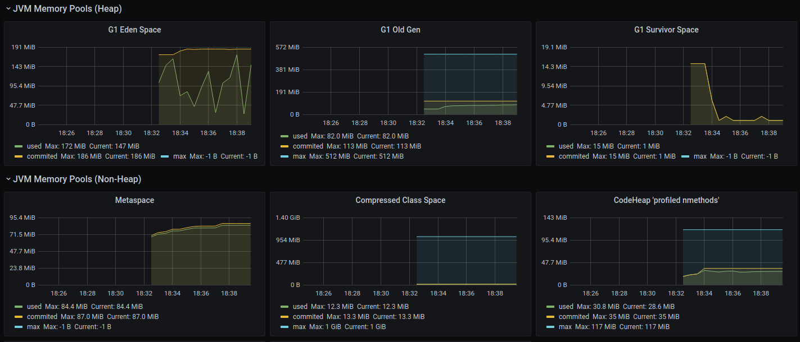
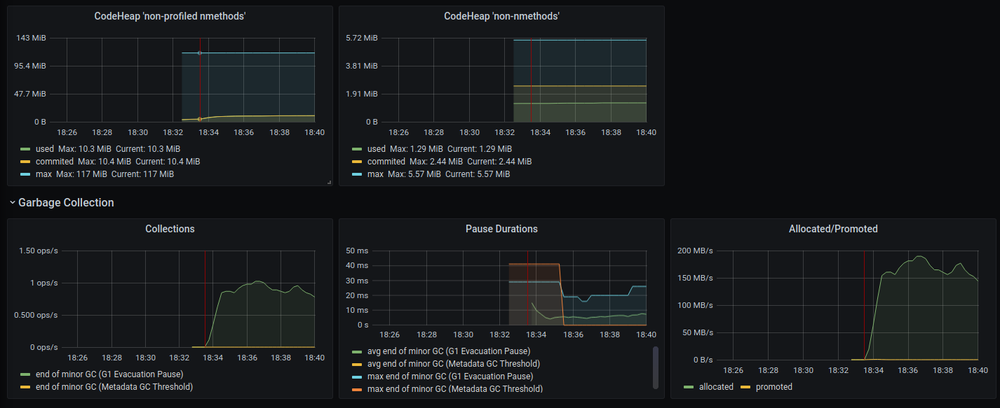
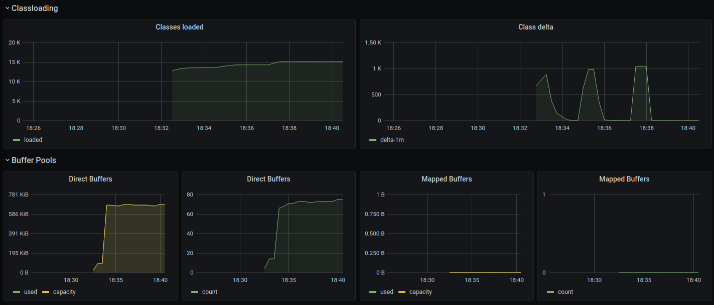
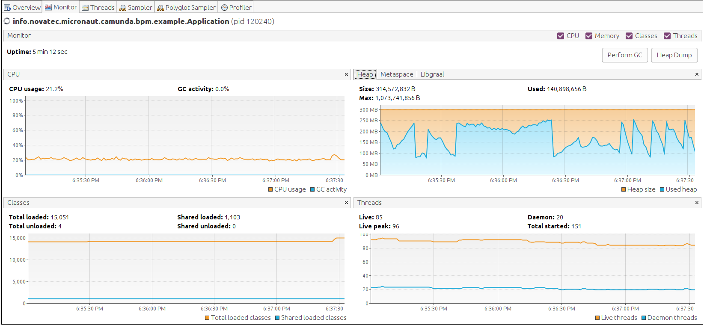

# Example Application
## Get the Code

Create a local Git clone:

`git clone https://github.com/NovatecConsulting/micronaut-camunda-bpm.git`

## Open in IntelliJ IDEA

To import the project into IntelliJ IDEA simply open the top-level `build.gradle` file and follow the instructions to import the project.

If you use the IntelliJ compiler then you should enable annotation processing under the "Build, Execution, Deployment → Compiler → Annotation Processors" by ticking the "Enable annotation processing" checkbox.

## Run the Example Application

### IntelliJ IDEA
To run the application in IntelliJ IDEA simply expand the sub-module `micronaut-camunda-bpm-example` and start `info.novatec.micronaut.camunda.bpm.example.Application`.

### Unix/Mac Console
To run the application in a console on Unix/Mac:
```
./gradlew clean run -p micronaut-camunda-bpm-example
```

### Windows Command Line
To run the application in a Windows command line:
```
gradlew.bat clean run -p micronaut-camunda-bpm-example
```

### Docker
To run the application in Docker:
```
./gradlew clean dockerBuild -p micronaut-camunda-bpm-example
docker run -p 8080:8080 micronaut-camunda-bpm-example:latest
```

## Using the Example Application

Two simple processes are deployed automatically.

The Camunda Cockpit is available at `http://localhost:8080/`. Login with `admin`/`admin`.

The Camunda REST API is available at the context path `/engine-rest`, e.g. `GET http://localhost:8080/engine-rest/engine`.

The following HTTP endpoints have been implemented as examples:
* `GET http://localhost:8080/example/name` will return "default" as the name of the default process engine.
* `GET http://localhost:8080/example/definitions` will return "Calculation,HelloWorld,Onboarding" as the currently deployed process models.
* `POST http://localhost:8080/example/onboarding/cancel/OnStartup` can be called to cancel an Onboarding instance by the business key "OnStartup". Further calls will fail (unless a new process instance is created manually via the Tasklist with the menu item "Start process").

If you start `ExternalTaskWorkerApplication` from the sub-module `example-external-task-worker` the external worker will process the external tasks which otherwise timeout after 10 seconds.

## Persistent Database

By default, the example app will use an H2 in-memory database which is created on application start-up. If you need a
persistent database then the easiest approach is to configure the H2 database to be backed up by a file by configuring
the data source's URL:

`datasources.default.url: jdbc:h2:file:~/micronautdb;DB_CLOSE_ON_EXIT=FALSE`

To reset the database simply delete the `micronautdb*` files in your home directory.

## Load/Performance Tests

To get some impression on how much memory is used, the application perform and so do the following:

```bash
# build the example application
./gradlew clean build distTar

# untar example application
tar -C micronaut-camunda-bpm-example/build/distributions -xvf micronaut-camunda-bpm-example/build/distributions/micronaut-camunda-bpm-example-0.0.1-SNAPSHOT.tar

# define current user ID for docker-compose.yml
export UID=$(id -u)
# define current group ID for docker-compose.yml
export GID=$(id -g)
# start postgres, prometheus, grafana
docker-compose -f micronaut-camunda-bpm-example/docker-compose.yml up

# define some Java Options
export JAVA_OPTS="-Xmx512m -XX:+UseG1GC -XX:MaxRAMPercentage=75.0 -XX:+ExitOnOutOfMemoryError"
# define micronaut environment to use postgres instead of h2
export MICRONAUT_ENVIRONMENTS=postgres
# start example application
micronaut-camunda-bpm-example/build/distributions/micronaut-camunda-bpm-example-0.0.1-SNAPSHOT/bin/micronaut-camunda-bpm-example

# start external worker
./gradlew :example-external-task-worker:run

# open grafana in your browser http://localhost:3000/
# Login with admin/admin
# Open JVM Dashboard and watch it
# or open HikariCP Dashboard to see usage of connection pool
 
# now start jmeter and open Loadtest.jmx and run it

# keep watching grafana dashboard
```







instead of watching grafana you can of course watch the metrics with visualvm or some other tool

